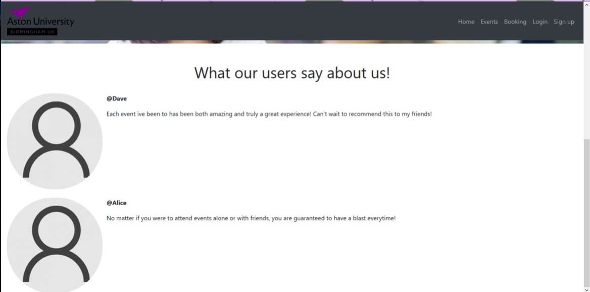
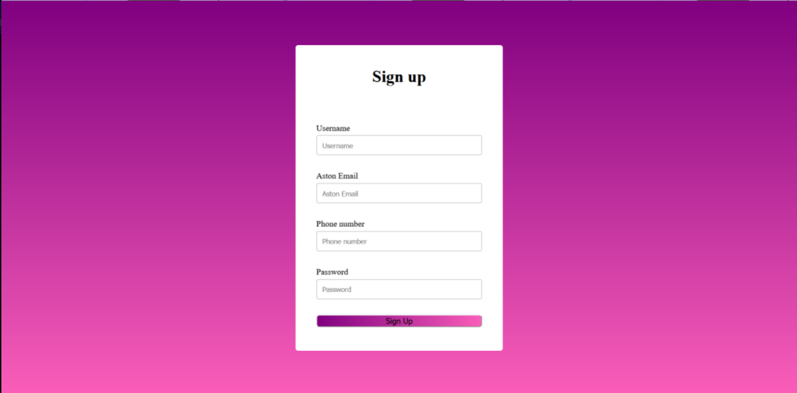
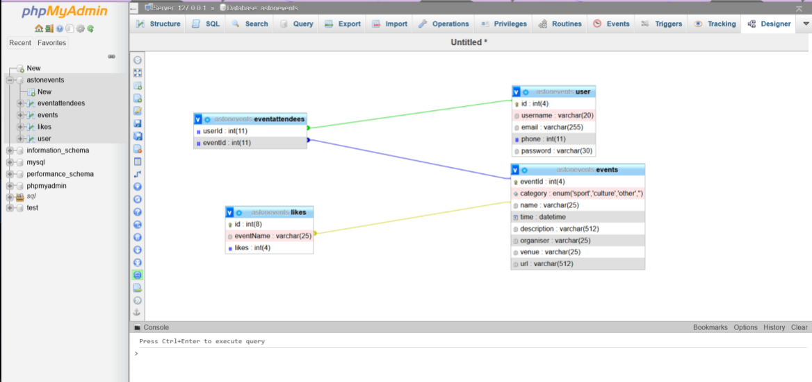

# Aston Events Website
This is a simple implementation of a website featuring different events that the user can apply for after registering. The user's details would be stored using PHPMyAdmin in a MySQL server but has since been deactivated.

## Requirements
- HTML
- Bootstrap CSS
- JS

## Website images
Homepage:

Comments:

Signup Page:

PHPMyAdmin:

